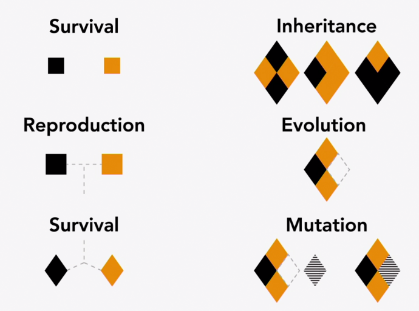

### Genetic Algorithm

- The **Genetic Algorithm** was first published in the book by **John Holland** (Scientist, 1929 - 2015) in 1960. Since then it has been used to solve **optimization problems** across many different industries like engineering, logistics and transportation. 
- Although many other **optimization algoritms** have been developed in the year since, the genetic algorithm remains one of the most popular because of its' simplicity and easy application to a wide range of optimization problems. 
- As the name suggests, the genetic algorithm is based loosely on the way **evolution** works in the nature. 

#### Natural Evolution

- In natural evolution, species evolve based on 3 concepts:
    1. Reproduction
    2. Mutation
    3. Survival of the fittest

- In nature, when an **offspring** is born, it competes with others in its' species to survive in its' environments. If it survive long enough into adulthood, it can reproduce with another member of its' species to create a new offspring. If the offspring inherits the best **traits** from both of its' parents, it's likely to perform as well, if not better than its' parents in the next generation. 
- Since an offspring recombines the parents' traits, more or less randomly, there's many ways for new offspring to be produced. However, reproduction alone cannot introduce the large scale changes necessary to ensure the long-term survival of the species. 
- To introduce new variations into the **gene pool**, certain traits of an organism undergo **random mutation**, either during reproduction or during its' development.

- By applying this basic process over millions of years, nature has evolved all of the different species we see on our planet today. 

- The **Genetic Algorithm** uses a similar process to evolve **high performing solutions** from a **generative model**. Just like in natural evolution, the algorithm works by creating many generations of designs one after another and does so in a way that the design in each generation are likely to be better than the designs in the generation before. It can do this for any generative model, no matter the design problem it's trying to solve 
- Genetic algorithm can be used to find the best performing solutions within the design space models.

